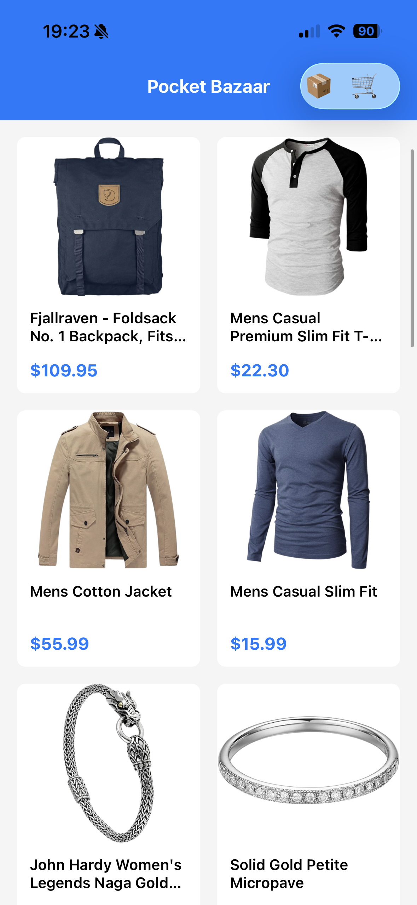
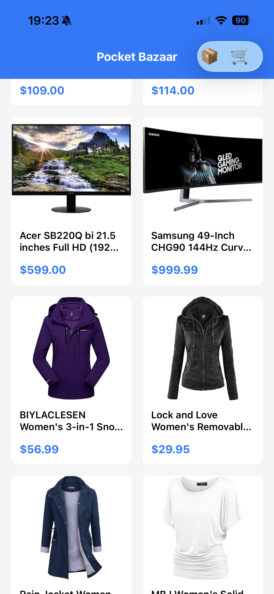
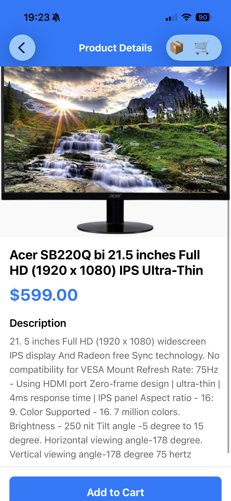
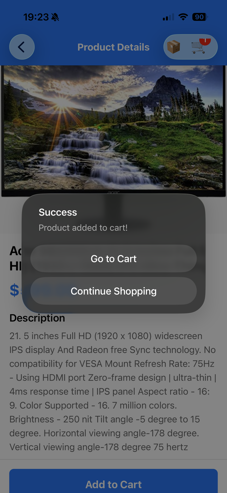
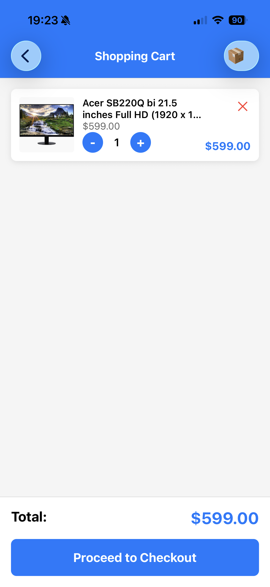
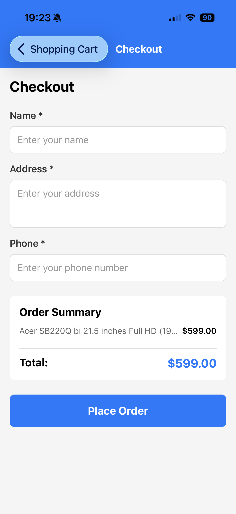
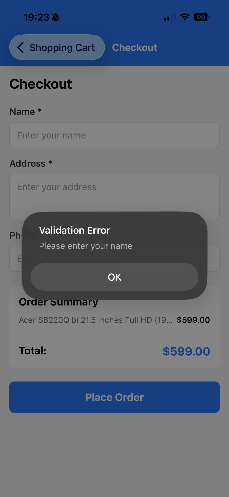
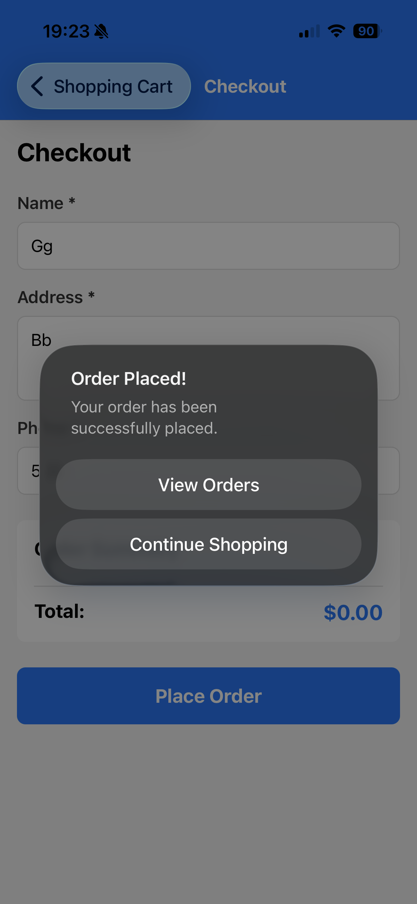
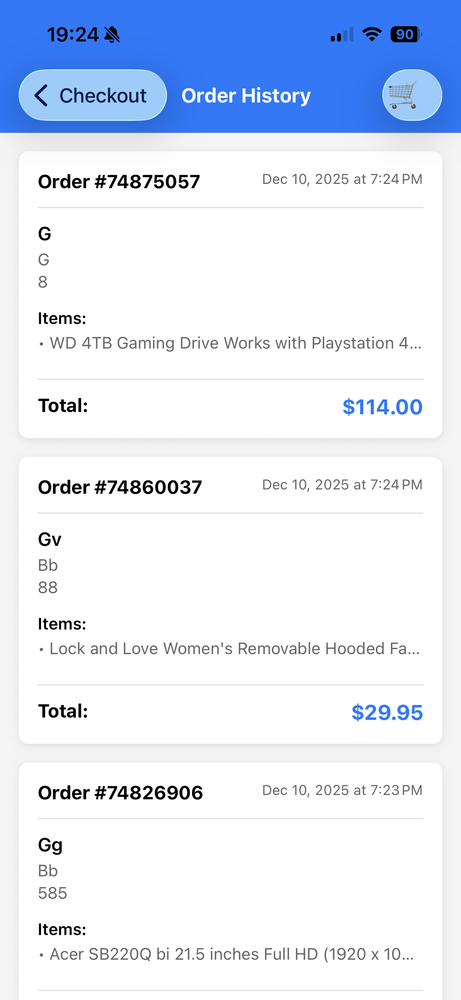

# Pocket Bazaar

A mobile e-commerce app built with React Native and Expo. Browse products, manage your cart, and place orders.

## Features

**Product Browsing**
- View products in a grid layout
- See product images, titles, and prices
- Tap any product to see full details

**Shopping Cart**
- Add items to cart from product details
- Adjust quantities with +/- buttons
- Remove items you don't want
- See total price update automatically
- Cart icon shows how many items you have

**Checkout**
- Fill in your name, address, and phone number
- Form validates that all fields are filled
- See order summary before placing order

**Order History**
- All your orders are saved locally
- View past orders with full details
- See what you ordered and when

## Running the App

```bash
npm start
```

Then press `w` for web, `i` for iOS simulator, or `a` for Android emulator.

## Tech Used

- React Native & Expo
- React Navigation for screens
- FakeStore API for product data
- AsyncStorage for saving orders
- Context API for cart state

## Screenshots












